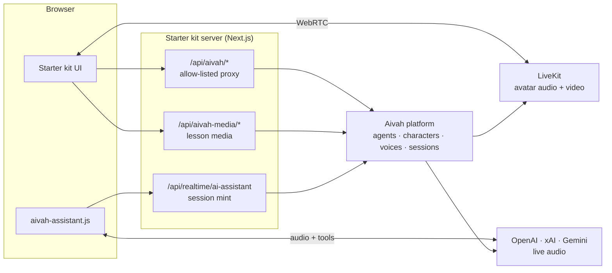

<div align="center">

# Aivah Starter Kit

**Ship a live AI avatar experience in minutes.**
A production-ready Next.js app for the [Aivah](https://aivah.ai) platform — real-time avatar conversations, agent-driven presentations, and a voice assistant that can see and use your page.

[](https://nextjs.org)
[](https://react.dev)
[](https://www.typescriptlang.org)
[](https://tailwindcss.com)
[](https://livekit.io)
[](https://pnpm.io)

[Quick start](#-quick-start) ·
[Features](#-what-you-get) ·
[Using the app](#-using-the-app) ·
[Voice assistant](#-the-voice-assistant-widget) ·
[Architecture](#-architecture) ·
[Deploy](#-deploying) ·
[Troubleshooting](#-troubleshooting)

</div>

---

## ✨ What you get

| | Feature | What it does |
|:-:|---|---|
| 🎭 | **Live avatar chat** | Talk to any Aivah agent by text or voice. A video character is streamed over LiveKit and chroma-keyed onto your chosen background. |
| 📽️ | **Interactive presentations** | Agents teach from PDF slides or chaptered video and drive page turns, seeks and playback themselves. Lessons panel, chapter list, quiz overlay and live transcription included. |
| 🗣️ | **Voice assistant widget** | A floating button that reads the current page, clicks and navigates on the user's behalf, and speaks through OpenAI, Grok or Gemini live-audio models — all via your Aivah key. |
| 🧩 | **Management screens** | Create and manage characters, backgrounds, voices (including cloning from a mic recording) and agents. |
| ⚡ | **Productivity generators** | Turn an agent's knowledge into slides, a podcast or a mind map. |
| 🔒 | **Secure by default** | Your Aivah API key never leaves the server. The browser only talks to this app's own allow-listed proxy routes. |

---

## 🚀 Quick start

> **You'll need:** Node.js 22+, [pnpm](https://pnpm.io) 11+, and an Aivah API key (`sk_aivah_…`) from your Aivah dashboard.

```bash
git clone https://github.com/aivahai/Aivahstarterkit.git
cd Aivahstarterkit
cp .env.example .env.local     # then set AIVAH_API_KEY inside
pnpm install
pnpm dev
```

Open **http://localhost:3000** — you'll land on **Chat**. 🎉

If the key is missing or invalid, the UI shows a safe *"deployment not configured"* message rather than leaking the key or the raw error.

### Configuration

Everything is a server-side environment variable. Use `.env.local` in development; pass them to your host or container in production.

| Variable | Required | Description |
|---|:-:|---|
| `AIVAH_API_KEY` | ✅ | Your customer-scoped Aivah API key. |
| `AIVAH_API_BASE_URL` | ✅ | Aivah platform base URL. Default `https://api.aivah.ai/v1/platform`. |

> ⚠️ **Never** rename these to `NEXT_PUBLIC_*` — that would ship your key to every visitor.

---

## 🧭 Using the app

The sidebar has two groups — **Experience** (Chat) and **Platform** (everything you manage).

<table>
<tr>
<td width="50%" valign="top">

### 💬 Chat
1. Pick an agent — **Standard** or **Presentation**.
2. Choose an LLM model and a compatible voice.
3. Optionally pick a character and background.
4. Type a message and **Start conversation**, or **Start presentation**.

Once live, chat by text or toggle the microphone. Presentation agents get a full stage: PDF viewer or video player under the agent's control, lessons panel, chapters, quiz and a collapsible transcript.

</td>
<td width="50%" valign="top">

### 🎭 Characters
Manage the avatars your agents appear as, plus the image/video **backgrounds** behind them.

### 🎙️ Voices
Browse voices and **clone** a new one from an audio file or a recording made right in the browser.

### 🤖 Agents
Create, inspect, retry and delete agents. Set a name, persona, prompt, text knowledge, URLs and file uploads. Presentation agents can carry PDF or video lessons.

</td>
</tr>
<tr>
<td valign="top">

### 🗣️ Assistant
Configure the voice assistant without touching code — provider, model, voice, instructions and knowledge. Saves to `public/aivah-assistant/`.

</td>
<td valign="top">

### ⚡ Productivity
Generate **slides**, a **podcast** or a **mind map** from an agent's knowledge, then view, play or delete the results.

</td>
</tr>
</table>

The agent ↔ client protocol behind presentations is documented in [presentation-implementation-guide.md](./presentation-implementation-guide.md).

---

## 🗣️ The voice assistant widget

The floating button on every page is [`public/aivah-assistant.js`](./public/aivah-assistant.js). It reads the page, can click and navigate for the user, and talks through a live-audio model. It's already wired into this app — and you can drop it into **any** website.

### Pick a provider

[`public/aivah-assistant/assistant.json`](./public/aivah-assistant/assistant.json):

```json
{
  "provider": "openai-live",
  "model": "gpt-live-1",
  "voice": "quartz"
}
```

| Provider | Example models | Example voices |
|---|---|---|
| `openai-live` | `gpt-live-1` | `quartz` `ripple` `vesper` `willow` … |
| `openai-realtime` | `gpt-realtime-2` `gpt-realtime` | `marin` `cedar` `alloy` … |
| `grok-realtime` | `grok-voice-latest` | `eve` `ara` `leo` … |
| `gemini-live` | `gemini-2.5-flash-native-audio-preview-12-2025` | `Puck` `Charon` `Kore` … |

Full presets: [`src/lib/assistant-config.ts`](./src/lib/assistant-config.ts). Provider API keys (OpenAI, xAI, Google) are held by Aivah — you only need your Aivah key.

### Give it context

Two optional Markdown files are combined and sent to Aivah when a session starts:

- [`instructions.md`](./public/aivah-assistant/instructions.md) — who the assistant is, what your site does, do's and don'ts
- [`knowledge.md`](./public/aivah-assistant/knowledge.md) — product facts it may quote

Aivah appends its own safety and tool rules server-side; those can't be overridden from the host. Edit both from the **Assistant** page in the app if you prefer a UI.

### Add it to another website

👉 [ai-fab-integration-instruction.md](./ai-fab-integration-instruction.md) — include one script tag, add one server route that mints a session with your Aivah key, done. A minimal Next.js route is included.

🔬 [ai-fab-architecture.md](./ai-fab-architecture.md) — how sessions and transports (WebRTC vs. WebSocket proxy) work per provider.

---

## 🏗️ Architecture



The browser never calls Aivah directly. Every request goes through `/api/aivah/<path>`, which:

1. Checks method + path against an explicit allow-list in [`route.ts`](./src/app/api/aivah/[...path]/route.ts) — anything else is `404 ROUTE_NOT_ALLOWED`
2. Attaches `AIVAH_API_KEY` from the server environment
3. Streams the upstream response back unchanged

Missing config → `503 CONFIG_MISSING`. Aivah unreachable → `502 UPSTREAM_UNAVAILABLE`. The UI renders both as friendly errors. To expose a new Aivah endpoint, add its method and path pattern to `ROUTES` in that file.

<details>
<summary><strong>📁 Project structure</strong></summary>

```
src/
├── app/
│   ├── new-chat/           Pick agent, model, voice, character → start
│   ├── chat/               Live conversation / presentation stage
│   ├── characters/         Characters and backgrounds
│   ├── voices/             Voice list and cloning
│   ├── agents/             Agent list, detail, create
│   ├── assistant/          Voice assistant settings editor
│   ├── productivity/       Slides / podcast / mindmap generation
│   └── api/
│       ├── aivah/[...path]/          Allow-listed proxy to the Aivah API
│       ├── aivah-media/…             Streams agent content (PDF/video)
│       ├── realtime/ai-assistant/    Mints assistant sessions + OpenAI SDP
│       └── aivah-assistant/config/   Reads/writes the assistant config files
├── components/
│   ├── chat/               Avatar stage, chroma-key video, composer pickers
│   ├── presentation/       PDF viewer, video source, chapters, quiz, outline
│   ├── productivity/       Generation dialogs, mindmap viewer, podcast player
│   ├── ai-elements/        Conversation, message, prompt input
│   └── ui/                 shadcn/ui primitives
├── lib/
│   ├── api.ts              Browser-side fetch helper (talks to /api/aivah)
│   ├── api-types.ts        Types for agents, characters, voices, sessions, …
│   ├── server/aivah.ts     Reads and validates AIVAH_* env vars
│   └── presentation-*.ts   Presentation data + lesson handling
└── store/                  Zustand stores (LiveKit room, presentation, chapters)
public/
├── aivah-assistant.js      The voice assistant widget
└── aivah-assistant/        assistant.json, instructions.md, knowledge.md
```

</details>

<details>
<summary><strong>🎨 Where to customise</strong></summary>

| What | Where |
|---|---|
| Branding & navigation | [`src/components/app-shell.tsx`](./src/components/app-shell.tsx) |
| Theme & colours | [`src/app/globals.css`](./src/app/globals.css) — Tailwind v4 + shadcn tokens, light/dark via `next-themes` |
| Assistant persona | `public/aivah-assistant/instructions.md`, `knowledge.md` |
| Assistant provider / voice | `public/aivah-assistant/assistant.json` |
| Allowed Aivah endpoints | `ROUTES` in [`src/app/api/aivah/[...path]/route.ts`](./src/app/api/aivah/[...path]/route.ts) |

</details>

---

## 🧪 Scripts

| Command | What it does |
|---|---|
| `pnpm dev` | Dev server on port 3000 |
| `pnpm build` | Production build (standalone output) |
| `pnpm start` | Serve the production build |
| `pnpm lint` | ESLint |
| `pnpm typecheck` | TypeScript, no emit |
| `pnpm test` / `pnpm test:watch` | Unit tests (Vitest) |
| `pnpm test:e2e` | End-to-end tests (Playwright) |

Full quality gate before shipping:

```bash
pnpm lint && pnpm typecheck && pnpm test && pnpm build
pnpm exec playwright install chromium   # first time only
pnpm test:e2e
```

The e2e suite mocks the Aivah API, so it runs without a real key.

---

## 🚢 Deploying

### Docker

```bash
docker build -t aivah-starter-kit .
docker run --rm -p 3000:3000 \
  -e AIVAH_API_BASE_URL=https://api.aivah.ai/v1/platform \
  -e AIVAH_API_KEY=sk_aivah_replace_me \
  aivah-starter-kit
```

Multi-stage build ending in a small `node:alpine` runner with Next.js standalone output. Secrets are passed at runtime, never baked in.

### Any Node host

`pnpm build` produces a standalone server in `.next/standalone`. Run `node server.js` with the two `AIVAH_*` variables set. Vercel and similar platforms work out of the box — just add the env vars in their dashboard.

### Production checklist

- [ ] **Serve over HTTPS** — the microphone and WebRTC require a secure origin.
- [ ] **Commit your assistant config** — the Assistant settings page writes to `public/aivah-assistant/` on disk, which won't persist on immutable or multi-instance hosts.
- [ ] **Review `allowedDevOrigins`** in `next.config.ts` — it lists dev-only origins (e.g. an ngrok tunnel).

---

## 🩹 Troubleshooting

| Symptom | Likely cause |
|---|---|
| *"This deployment is not configured"* | `AIVAH_API_KEY` or `AIVAH_API_BASE_URL` not set on the server. Restart after editing `.env.local`. |
| Key-related error from Aivah | Key is disabled, revoked, expired, or belongs to another customer. Check your Aivah dashboard. |
| Assistant button does nothing / no mic prompt | Not served over HTTPS (or `localhost`). Browsers block the mic on insecure origins. |
| `404 ROUTE_NOT_ALLOWED` in the network tab | Endpoint isn't in the proxy allow-list — add it to `ROUTES`. |
| *"provider and model are required"* | `assistant.json` is missing or malformed. |

---

## 📚 Further reading

| Doc | Covers |
|---|---|
| [ai-fab-integration-instruction.md](./ai-fab-integration-instruction.md) | Embedding the voice assistant in any site |
| [ai-fab-architecture.md](./ai-fab-architecture.md) | How assistant sessions and transports work |
| [presentation-implementation-guide.md](./presentation-implementation-guide.md) | The agent ↔ client protocol for slide and video lessons |

<div align="center">
<sub>Built with ❤️ by <a href="https://aivah.ai">Aivah</a></sub>
</div>
