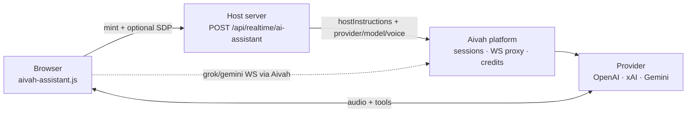
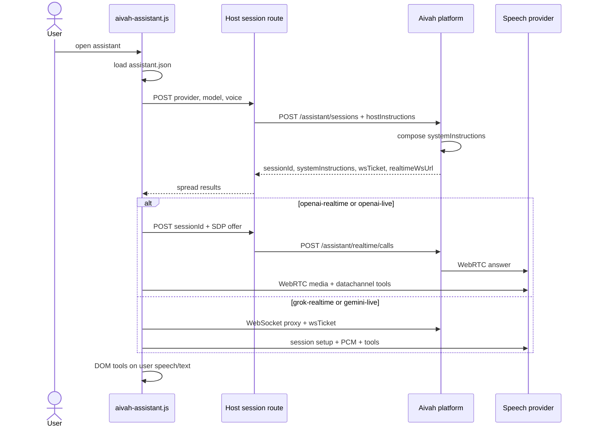

# Aivah Assistant — architecture notes

> **Internal reference only** — personal notes for understanding the system. Not part of the public integration contract. See [ai-fab-integration-instruction.md](./ai-fab-integration-instruction.md) for what to ship.

---

## Overview

The embeddable voice FAB (`aivah-assistant.js`) runs in the browser, reads the live page, and calls built-in DOM tools. Your server holds `AIVAH_API_KEY` and proxies session mint to the Aivah platform. Provider keys (`OPENAI_API_KEY`, `XAI_API_KEY`, `GOOGLE_API_KEY`) stay on Aivah.

**Instruction split**

| Layer | Where | What |
|-------|--------|------|
| Platform (mandatory) | Aivah `composeAssistantInstructions()` | Role, vendor restrictions, silence on connect, UI/tool rules |
| Host (optional) | `public/aivah-assistant/instructions.md`, `knowledge.md` | Assistant name, site brief, do/don't |

Mint returns `systemInstructions` (platform + host). The widget only appends runtime context (pathname + UI snapshot).

**Providers**

| Provider | Transport | Notes |
|----------|-----------|--------|
| `openai-realtime` | WebRTC P2P | SDP via host session route; `/v1/realtime/calls` |
| `openai-live` | WebRTC P2P | SDP via same host route; `/v1/live/sessions` + Responses delegation |
| `grok-realtime` | WebSocket → xAI | Browser connects via Aivah WS proxy; `session.update` instructions rewritten server-side |
| `gemini-live` | WebSocket → Google | Ephemeral token locks `systemInstruction`; Aivah WS proxy |

---

## System context



---

## Connect sequence



---

## Starter-kit layout

| Path | Role |
|------|------|
| `public/aivah-assistant.js` | FAB, transports, DOM tools |
| `public/aivah-assistant/assistant.json` | `provider`, `model`, `voice` |
| `public/aivah-assistant/instructions.md` | Host context (optional) |
| `public/aivah-assistant/knowledge.md` | Product facts (optional) |
| `src/app/api/realtime/ai-assistant/route.ts` | Mint proxy + OpenAI SDP on same route |
| `src/lib/server/aivah.ts` | `AIVAH_API_BASE_URL`, `AIVAH_API_KEY` |

Tools are defined in the script — hosts do not ship a tools file.

---

## Platform assistant module (`chatbot-api`)

```
assistant/
├── types/           # Mint types, adapter interface
├── instructions/  # Platform policy + compose
├── session/       # Mint service + ephemeral store
├── adapters/      # openai, grok, gemini, livekit
├── realtime/      # WS proxies, WebRTC calls, ws URL
└── credits/       # Usage metering
```
